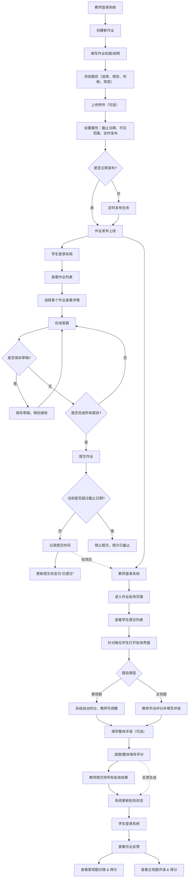
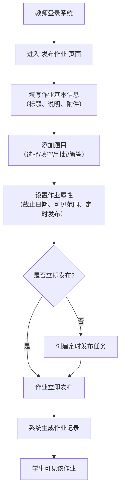
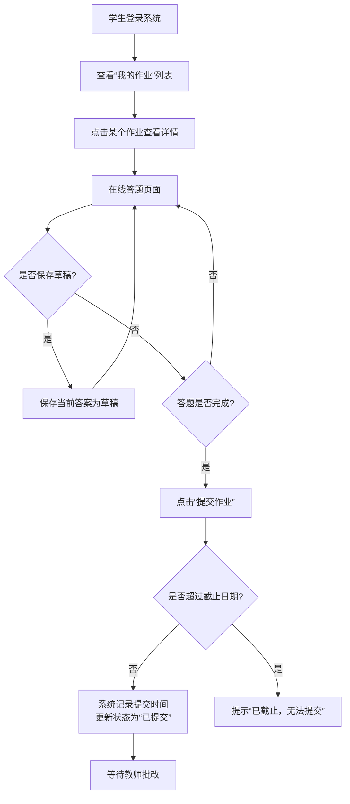
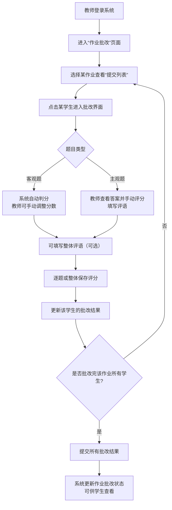
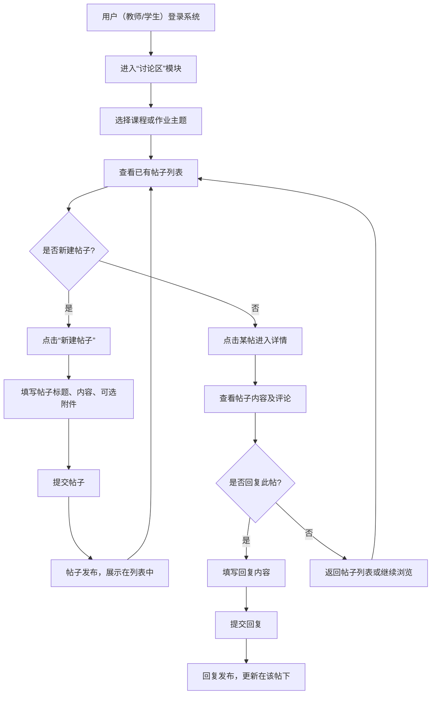

# 流程图

```mermaid
flowchart TD
  %% 教师发布作业流程
  A1[教师登录系统] --> A2[创建新作业]
  A2 --> A3[填写作业标题/说明]
  A3 --> A4[添加题目（选择、填空、判断、简答）]
  A4 --> A5[上传附件（可选）]
  A5 --> A6[设置属性：截止日期、可见范围、定时发布]
  A6 --> A7{是否立即发布?}
  A7 -- 是 --> A8[作业发布上线]
  A7 -- 否 --> A9[定时发布任务]
  A9 --> A8

  %% 学生提交作业流程
  A8 --> B1[学生登录系统]
  B1 --> B2[查看作业列表]
  B2 --> B3[选择某个作业查看详情]
  B3 --> B4[在线答题]
  B4 --> B5{是否保存草稿?}
  B5 -- 是 --> B6[保存草稿，稍后继续]
  B6 --> B4
  B5 -- 否 --> B7{是否完成所有题目?}
  B7 -- 否 --> B4
  B7 -- 是 --> B8[提交作业]
  B8 --> B9{当前是否超过截止日期?}
  B9 -- 否 --> B10[记录提交时间]
  B9 -- 是 --> B11[禁止提交，提示已截止]
  B10 --> B12[更新提交状态为“已提交”]

  %% 教师批改作业流程
  A8 --> C1[教师登录系统]
  C1 --> C2[进入作业批改页面]
  C2 --> C3[查看学生提交列表]
  C3 --> C4[针对每位学生打开批改界面]
  C4 --> C5{题目类型}
  C5 -- 客观题 --> C6[系统自动判分，教师可调整]
  C5 -- 主观题 --> C7[教师手动评分并填写评语]
  C6 --> C8[填写整体评语（可选）]
  C7 --> C8
  C8 --> C9[逐题/整体保存评分]

  %% 学生查看反馈流程
  C9 --> D1[教师提交完所有批改结果]
  D1 --> D2[系统更新批改状态]
  D2 --> D3[学生登录系统]
  D3 --> D4[查看作业反馈]
  D4 --> D5[查看客观题对错 & 得分]
  D4 --> D6[查看主观题评语 & 得分]

  %% 各流程间的关系标注
  B10 -.->|批改后| C1
  C9 -.->|反馈生成| D2
```

## 教师发布作业流程图

```mermaid
flowchart TD
  %% 教师发布作业
  T1[教师登录系统] --> T2[进入“发布作业”页面]
  T2 --> T3[填写作业基本信息<br/>（标题、说明、附件）]
  T3 --> T4[添加题目<br/>（选择/填空/判断/简答）]
  T4 --> T5[设置作业属性<br/>（截止日期、可见范围、定时发布）]
  T5 --> T6{是否立即发布?}
  T6 -- 是 --> T7[作业立即发布]
  T6 -- 否 --> T8[创建定时发布任务]
  T8 --> T7
  T7 --> T9[系统生成作业记录]
  T9 --> T10[学生可见该作业]
```

## 学生提交作业流程图

```mermaid
flowchart TD
  %% 学生完成提交
  S1[学生登录系统] --> S2[查看“我的作业”列表]
  S2 --> S3[点击某个作业查看详情]
  S3 --> S4[在线答题页面]
  S4 --> S5{是否保存草稿?}
  S5 -- 是 --> S6[保存当前答案为草稿]
  S6 --> S4
  S5 -- 否 --> S7{答题是否完成?}
  S7 -- 否 --> S4
  S7 -- 是 --> S8[点击“提交作业”]
  S8 --> S9{是否超过截止日期?}
  S9 -- 否 --> S10[系统记录提交时间<br/>更新状态为“已提交”]
  S9 -- 是 --> S11[提示“已截止，无法提交”]
  S10 --> S12[等待教师批改]
```

## 教师批改作业流程图

```mermaid
flowchart TD
  %% 教师批改
  G1[教师登录系统] --> G2[进入“作业批改”页面]
  G2 --> G3[选择某作业查看“提交列表”]
  G3 --> G4[点击某学生进入批改界面]
  G4 --> G5{题目类型}
  G5 -- 客观题 --> G6[系统自动判分<br/>教师可手动调整分数]
  G5 -- 主观题 --> G7[教师查看答案并手动评分<br/>填写评语]
  G6 --> G8[可填写整体评语（可选）]
  G7 --> G8
  G8 --> G9[逐题或整体保存评分]
  G9 --> G10[更新该学生的批改结果]
  G10 --> G11{是否批改完该作业所有学生?}
  G11 -- 否 --> G3
  G11 -- 是 --> G12[提交所有批改结果]
  G12 --> G13[系统更新作业批改状态<br/>可供学生查看]
```

## 讨论区交流流程图

```mermaid
flowchart TD
  %% 讨论区交流
  D1[用户（教师/学生）登录系统] --> D2[进入“讨论区”模块]
  D2 --> D3[选择课程或作业主题]
  D3 --> D4[查看已有帖子列表]
  D4 --> D5{是否新建帖子?}
  D5 -- 是 --> D6[点击“新建帖子”]
  D6 --> D7[填写帖子标题、内容、可选附件]
  D7 --> D8[提交帖子]
  D8 --> D9[帖子发布，展示在列表中]
  D5 -- 否 --> D10[点击某帖进入详情]
  D10 --> D11[查看帖子内容及评论]
  D11 --> D12{是否回复此帖?}
  D12 -- 是 --> D13[填写回复内容]
  D13 --> D14[提交回复]
  D14 --> D15[回复发布，更新在该帖下]
  D12 -- 否 --> D16[返回帖子列表或继续浏览]
  D16 --> D4
  D9 --> D4
```
